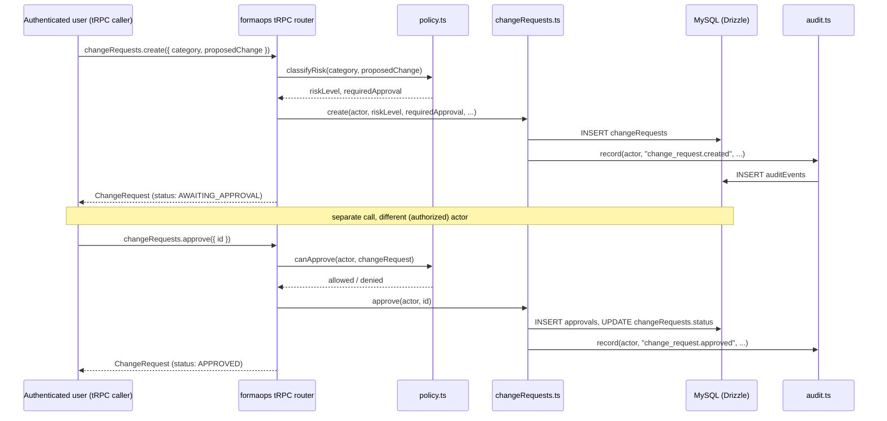

# FormaOps — Architecture Review

Status: **Phase 0 complete.** This document is the required architecture
review gate (spec §8) before any FormaOps implementation. It is grounded in
direct inspection of the repository as it exists today — nothing below is
assumed or carried over from the specification's own examples.

## 1. Existing Architecture

**This is not the stack the specification assumes.** The spec repeatedly
references Next.js, Prisma, and PostgreSQL. The actual repository is:

| Layer | Reality |
|---|---|
| Frontend | Vite + React 19 + `wouter` (not Next.js — no file-based routing, no RSC, no server actions) |
| Backend | Express + tRPC v11, one process (`server/_core/index.ts`) |
| ORM | Drizzle ORM (not Prisma) |
| Database | MySQL (not PostgreSQL) — single instance, single schema, no tenant column anywhere |
| Auth | Custom JWT-in-cookie, `jose` for signing, `bcryptjs` for passwords. Email/password only — the legacy Manus-OAuth cookie format has been removed |
| Authorization | `users.role` enum: `"user" | "admin" | "employee"`. Checked via two tRPC middlewares (`protectedProcedure`, `adminProcedure`) and a repeated `adminOnly(role)` helper duplicated across ~10 router files. **No permissions table. No fine-grained checks. No memberships. No tenant concept.** |
| Migrations | Plain numbered `.sql` files in `drizzle/`, applied by `scripts/migrate.mjs`, tracked via `__drizzle_migrations`. Current head: `0013_booking_provider_integration.sql` |
| Background jobs | Two HTTP `GET` endpoints (`/api/cron/process-followup`, `/api/cron/process-reminders`) gated by a shared `CRON_SECRET` header, presumably hit by an external scheduler (Railway cron or similar). **No queue, no worker process, no retry/backoff, no job leasing.** Durable job-*like* tables exist for these two specific flows (`followUpQueue`, `appointmentReminders`) — each row has a `status`/`scheduledFor`, which is the closest existing precedent for a durable-job pattern |
| Deployment | Single Dockerfile → single Railway service. `pnpm build` runs inside the image (fresh `client/public/` → `dist/public/`, so config baked at deploy time). No preview environments, no staging, no CI pipeline beyond whatever Railway does on push |
| Admin | Not a separate app — more React routes (`/admin/*`) in the *same* SPA, gated by `adminProcedure` server-side and a client-side redirect. Shares the same Express server, same DB connection, same deploy |
| Business data | Centralized in `shared/brand.ts` (a plain TS const object, imported by both client and server — no DB) and `shared/services.ts` (package/pricing catalog, with the `packages`/`addOns` DB tables as an operational override layer that gets wiped-and-reseeded on every server boot from `server/_core/index.ts`'s `seedDefaultContent()`) |
| Integrations | Square (payments, inline in `server/routers/payments.ts` — no SDK, raw `fetch`), SendGrid (email, raw `fetch`), Twilio (SMS, raw `fetch`), Urable (third-party detailing CRM sync), Meta Pixel (client-side), Umami (self-hosted analytics) |
| Tests | Vitest, ~60 tests across `server/*.test.ts`. No Playwright currently wired into CI (Playwright *is* used ad hoc this session for visual QA, via a scratch install, not a repo dependency) |
| OpenAI | **Not present.** No `openai` package, no Agents SDK, in `package.json` |

This is a small, single-tenant, single-service application — not a
distributed system, not multi-tenant, not currently running any AI.

## 2. FormaOps Requirements (recap)

RBAC with fine-grained permissions; durable approval workflow surviving
restarts; ChangeRequest as a first-class entity; append-only audit log;
structured business data with one source of truth; OpenAI Agents SDK
orchestration with a hard deterministic authorization boundary; background
job execution for long-running agent/build/deploy work; multi-tenant-ready
data shape (without building multi-tenant SaaS infrastructure yet); SMS as
a verified external channel; a controlled AI code-change pipeline with
sandboxing, tests, preview, deploy, rollback.

## 3. Constraints

- One engineer session at a time; no existing CI/CD to hook into beyond
  Railway's git-push deploy
- No infrastructure beyond Railway + MySQL + Cloudflare exists today —
  every new piece of infrastructure (queue, worker, sandbox) is a new
  operational cost and failure mode
- The production site (formaautospa.com) must keep working throughout —
  this is a live business, not a greenfield project
- Budget/vendor reality: OpenAI API usage has a real dollar cost per
  request; this affects Decision D1 below

## 4. Architecture Options Considered

**Option A — FormaOps lives inside the existing app/runtime.** New
tables, a bounded `server/formaops/` module (policy, permissions, change
requests, audit), a new tRPC router, reusing the existing Express process,
existing DB connection, existing deploy. No new services.

**Option B — Monorepo split** (`apps/web, apps/admin, apps/formaops,
apps/worker` + `packages/*`), as the spec's §9 "preferred hypothesis"
sketches.

**Option C — FormaOps as a fully separate service/repo**, existing site
untouched, talking to it over an internal API.

**Option D — Hybrid, staged**: start as Option A; peel off a separate
**worker** (not a full monorepo) only when a concrete capability needs it
(sandboxed code-changes in Phase 7, long OpenAI agent runs in Phase 4-5)
— i.e., let real requirements pull the runtime boundary into existence
rather than pre-building it.

## 5. Comparison Matrix

| Criterion | A: In-process | B: Monorepo | C: Separate service | D: Staged (A→worker later) |
|---|---|---|---|---|
| Migration cost today | None | High (new build/deploy pipeline, tsconfig/vite duplication, workspace tooling) | High (new repo, new auth trust, new deploy) | None today |
| Privilege isolation | Weak until split | Strong from day 1 | Strongest | Weak now, strong when it matters |
| Dev experience (1 engineer, small team) | Simple | Heavier (workspace commands, cross-package types) | Context-switching between repos | Simple, grows only when needed |
| Matches current traffic/scale | Yes | Over-built for current scale | Over-built | Yes |
| Background/long-running work | Needs a worker eventually regardless | Native (`apps/worker`) | Native | Added when Phase 4-7 actually need it |
| Blast radius of a FormaOps bug | Can affect public site (same process) — mitigated by module boundary + tests, not process isolation | Isolated by construction | Fully isolated | Isolated once worker exists; mitigated by tests/typecheck until then |
| Time to first working ChangeRequest flow | Fast | Slow (infra first) | Slow (infra first) | Fast |
| Future multi-tenant/scale-out | Requires later refactor | Ready | Ready | Ready when D's worker split happens, at lower cost than jumping straight to B |

## 6. Recommended Architecture: **Option D (staged), starting from Option A**

This **disagrees with §9's "preferred hypothesis"** on purpose (per §8.13,
which explicitly invites this). The monorepo (`apps/`, `packages/`)
structure is a reasonable *eventual* shape once FormaOps is doing
privileged work (running an OpenAI agent that can propose source-code
changes, holding deploy/rollback credentials) — but building that
structure **today**, before a single ChangeRequest has ever been created,
means paying full distributed-system tax for a governance layer that
doesn't have a database row yet. The existing app is one Express process
serving a few thousand-request-a-day mobile detailing business. A queue +
worker + multi-app monorepo is not justified by anything in the current
repository.

Concretely:

- **Now (Phase 1-3)**: everything lives in this repo, in a new
  `server/formaops/` module with a deliberately narrow public surface
  (`policy.ts`, `permissions.ts`, `changeRequests.ts`, `audit.ts`),
  exposed through one new tRPC router (`server/routers/formaops.ts`).
  New DB tables in the same MySQL instance, same migration mechanism
  already in use.
- **Later, when justified (Phase 4+)**: once the OpenAI Agents SDK is
  introduced and starts doing work worth isolating (long agent runs,
  sandboxed code edits, deployment execution), split **only that** into
  a separate worker process — not a full monorepo, just a second
  `Procfile`/Railway service reading from the same DB with a
  narrower-privilege DB role. Re-evaluate the monorepo question at that
  point with real code to look at.

This is not a permanent rejection of Option B — it's a rejection of
building it *speculatively*.

## 7. Repository Structure (current phase)

```
server/
  formaops/
    policy.ts          # risk classification, approval-requirement computation
    permissions.ts      # permission catalog + hasPermission()
    changeRequests.ts    # create/approve/reject/execute service functions
    audit.ts            # append-only audit log writer
  routers/
    formaops.ts          # tRPC router exposing the above
drizzle/
  0014_formaops_governance_foundation.sql
docs/formaops/
  README.md, ARCHITECTURE-REVIEW.md (this file), ARCHITECTURE.md,
  ROADMAP.md, DATABASE.md, PERMISSIONS.md, AGENTS.md, SECURITY.md,
  DECISIONS.md, STATUS.md
```

No `apps/`, no `packages/`, no new deploy target, no new repo.

## 8. Runtime Structure

One Express process (as today). `server/formaops/*` is a plain module
boundary (enforced by code review discipline and tests, not a process
boundary) — it is the seam a future worker-split would cut along.

## 9. Data Flow (Phase 1 slice)



Execution (actually applying the approved change to business data) is
**not** implemented in Phase 1 — see STATUS.md. Phase 1 proves the
governance path; Phase 2 wires it to real business data (pricing/hours/etc).

## 10. Authentication Flow

Unchanged from today: JWT-in-cookie, `createContext` resolves `ctx.user`.
FormaOps does not introduce a second auth system — every FormaOps
procedure runs on top of the existing `protectedProcedure`.

## 11. Authorization Flow

New. `hasPermission(user, permission, businessId)` in
`server/formaops/permissions.ts` is the single choke point. It:
1. resolves the user's membership/role for the given business
2. looks up whether that role grants the requested permission
3. returns a boolean — **never** a partial/fuzzy answer

No tRPC procedure or future OpenAI tool may execute a side effect without
going through this function first. This is enforced by code convention
today (no framework-level guarantee exists yet — see §16 Security
Considerations for the honest caveat).

## 12. Approval Flow

See §9 diagram above. Persisted in `changeRequests` + `approvals` tables —
survives process restart by construction (it's a database row, not
in-memory state).

## 13. Agent Execution Flow

**Not implemented.** No OpenAI SDK in this repository yet. Deferred to
Phase 4. When it lands, the boundary is: the agent may call
`changeRequests.create` and read-only tools; it may **never** call
`approve`, `execute`, or anything requiring a permission the calling
identity (`AI_SYSTEM` role) doesn't hold. `AI_SYSTEM` is seeded in Phase 1's
permission catalog with `*.request_change` grants only — no
`*.approve_change`, no `deployments.*`, no `security.*`.

## 14. Deployment Flow

Unchanged from today (Railway git-push deploy). No FormaOps-driven
deployment automation exists yet (Phase 8).

## 15. Trust Boundaries

| Boundary | Today | Phase 1 addition |
|---|---|---|
| Public website ↔ FormaOps | Same process | Still same process — mitigated by `formaops/` module boundary + permission checks, not by a process wall |
| Human user ↔ AI system | N/A (no AI yet) | `AI_SYSTEM` is a real row in `rolePermissions`, deliberately under-privileged relative to `OWNER` |
| Request ↔ approval | N/A | A ChangeRequest's `submittedByUserId` and any `approvals.approvedByUserId` are checked to differ — see §16 |

A hard **process-level** trust boundary (separate worker, separate DB
role) does not exist yet and is intentionally deferred — see §6.

## 16. Database Ownership

Same MySQL instance, same Drizzle schema file, same migration mechanism.
No new database, no new connection pool, no ORM introduced. This directly
answers spec §8.5: **Option B** (share the instance, and for now the same
DB role too — a narrower role is a Phase 4+ concern once a worker process
exists to hold it).

## 17. Background Job Architecture

**Not built in Phase 1.** The two existing cron endpoints are the only
precedent. When Phase 4+ needs durable long-running agent/build/deploy
jobs, the recommendation is to extend the *existing* durable-row pattern
(`followUpQueue`-style: a table with `status`/`scheduledFor`/`attempts`)
rather than introduce Redis/BullMQ — until job volume or concurrency
requirements outgrow a polled-table approach, which nothing in this
repository currently indicates. Revisit at Phase 4.

## 18. Failure Handling

Answering spec §8.8 directly, for the Phase 1 slice actually built:

- **FormaOps crashes**: it's the same process as the public site — a
  crash takes both down. This is the honest cost of Option A today (see
  §22 for how this is tracked as a real risk, not hidden).
- **DB unavailable**: `changeRequests.create`/`approve` throw; no
  partial writes (each is a single-table insert or a two-table
  transaction — see `changeRequests.ts`).
- **Approval recorded, later step crashes**: nothing later exists yet in
  Phase 1 (no execution step) — not applicable until Phase 2.
- **Double webhook delivery**: not applicable to Phase 1 (no webhooks
  added). Existing Square/Urable webhook handlers are unchanged.
- **Unauthorized operation attempted**: `hasPermission` denies and the
  tRPC procedure throws `FORBIDDEN` before any write — verified by tests
  in `server/formaops.test.ts`.
- **OpenAI unavailable**: not applicable yet — no dependency exists.

Everything else in spec §8.8 (agent crashes mid-deploy, broken
AI-generated code, prompt injection via scraped content) is genuinely
**not yet applicable** because those phases aren't built. Documented as
such in STATUS.md rather than answered hypothetically.

## 19. Security Considerations

See `SECURITY.md`.

## 20. Migration Strategy

Purely additive. `0014_formaops_governance_foundation.sql` only adds
tables — no existing table is altered, no existing data is touched,
`users.role` is untouched and keeps working exactly as it does today for
every existing admin check. Nothing about this migration is destructive
or requires the §8.14 approval gate.

## 21. Tradeoffs

Choosing Option A/D over B means: less isolation *today*, but zero
speculative infrastructure cost, and a real, reviewable seam
(`server/formaops/`) to cut along later. The cost is discipline — nothing
stops a future change from reaching into `formaops/` internals and
bypassing `hasPermission`, the way a process boundary would. That's an
accepted, explicit tradeoff, not an oversight.

## 22. Future Scaling Path

Multi-tenant: `businesses`/`businessMemberships` exist from Phase 1 (see
DATABASE.md) specifically so a second tenant doesn't require a data-model
rewrite later — but no tenant-selection UI, billing, or per-tenant
isolation enforcement is built. Worker split: see §6/§17. Monorepo: only
if/when more than one genuinely independently-deployable unit exists.

## 23. Architecture Decisions

Recorded as ADRs in `DECISIONS.md`.

---

## Answering §34's required sections directly

**A. Current state** — §1 above.
**B. Reuse** — existing JWT/cookie auth (unchanged), existing Drizzle
migration mechanism, existing tRPC router pattern, existing
durable-row-as-job precedent (`followUpQueue`), existing `shared/brand.ts`
/`shared/services.ts` single-source-of-truth pattern (extended, not
replaced, by structured business data in Phase 2).
**C. Gaps** — no permissions/roles tables, no ChangeRequest/approval
system, no audit log, no OpenAI dependency, no worker/queue, no
multi-tenant data shape, no SMS integration, no website inspector, no AI
code-change pipeline. All ten gaps map directly onto the ten phases in
`ROADMAP.md`.
**D/E. Options & recommendation** — §4-6 above.
**F. Diagram** — §9 above (Phase 1 slice); a full-system diagram is
deferred to `ARCHITECTURE.md` and will be filled in as each phase lands,
rather than drawn speculatively now.
**G. Database plan** — `DATABASE.md`.
**H. Security/governance plan** — `PERMISSIONS.md` + `SECURITY.md`.
**I. Background processing plan** — §17 above: not needed yet.
**J. Migration plan** — §20 above.
**K. Risks** — §22 of `SECURITY.md` and the risk table in `STATUS.md`.
**L. Decisions requiring owner approval** — see `DECISIONS.md`'s "Open
decisions" section at the bottom (OpenAI vendor cost/budget ceiling, SMS
provider choice, and the Phase 4 worker-split timing are flagged there —
everything else in Phase 1 is an ordinary engineering decision per §33).
