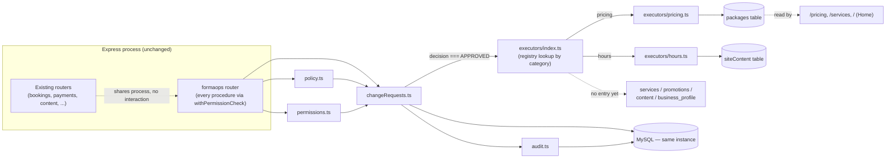

# FormaOps — Implemented Architecture

This is the **as-built** state, kept current as phases land (unlike
`ARCHITECTURE-REVIEW.md`, which is the point-in-time Phase 0 review and
should not be edited to describe later phases — add to this file instead).

## What exists today (Phase 1 + Phase 2 pricing/hours slices)

```
server/
  formaops/
    trpc.ts             — withPermissionCheck(): the permission-check tRPC
                          middleware builder (closes the Phase 1 hardening
                          gap — see SECURITY.md)
    permissions.ts       — permission catalog constants + hasPermission()
    policy.ts            — classifyRisk() + requiredApprovalRole()
    changeRequests.ts    — create/approve/reject + generic execution dispatch
    audit.ts             — record() — append-only writer
    executors/
      index.ts            — the executor registry: category -> {schema, execute}
      pricing.ts           — updates `packages.price`
      hours.ts             — upserts `siteContent`'s hours_weekday/hours_weekend
  routers/
    formaops.ts           — tRPC router, every procedure built with
                           withPermissionCheck(): changeRequests.{create,list,get,approve,reject}
drizzle/
  0014_formaops_governance_foundation.sql
    → businesses, businessMemberships, permissions, rolePermissions,
      changeRequests, approvals, auditEvents
server/formaops.test.ts — governance + execution behavior tests (19)
```

Wired into the app: `server/routers.ts` mounts `formaopsRouter` under
`trpc.formaops.*`. No UI consumes it yet — it's reachable via any tRPC
client (including, deliberately, a future OpenAI tool) the same way every
other router is.

Also changed as part of wiring execution:
- `server/_core/index.ts`'s package seed switched from wipe-and-replace to
  insert-if-missing — see `DECISIONS.md` ADR-007.
- `client/src/pages/Services.tsx` and `Home.tsx` now read a package's price
  from the same `trpc.bookings.getPackages` DB source `Pricing.tsx` already
  used, falling back to the `shared/services.ts` catalog only when no DB
  row exists for that package name.

## What does NOT exist yet

Everything in Phases 3-10 of `ROADMAP.md`, plus most of Phase 2:

- Only `pricing` and `hours` execute. `services`/`promotions`/`content`/
  `business_profile` reach `APPROVED` and stop there — no executor exists
  for them yet.
- Hours execution only covers the standing weekday/weekend strings, not
  per-date overrides.
- No admin UI for approvals (spec §17) — `changeRequests` are readable/
  writable only via tRPC calls, not a dashboard
- No OpenAI dependency, no chat surface, no SMS, no website inspector, no
  code-change pipeline, no deployment automation

## Diagram (current)



This diagram will be redrawn again as later phases add real edges (OpenAI,
worker, website inspector, deployment) — see `ROADMAP.md` for what's next.
